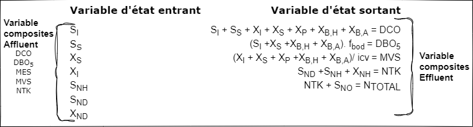
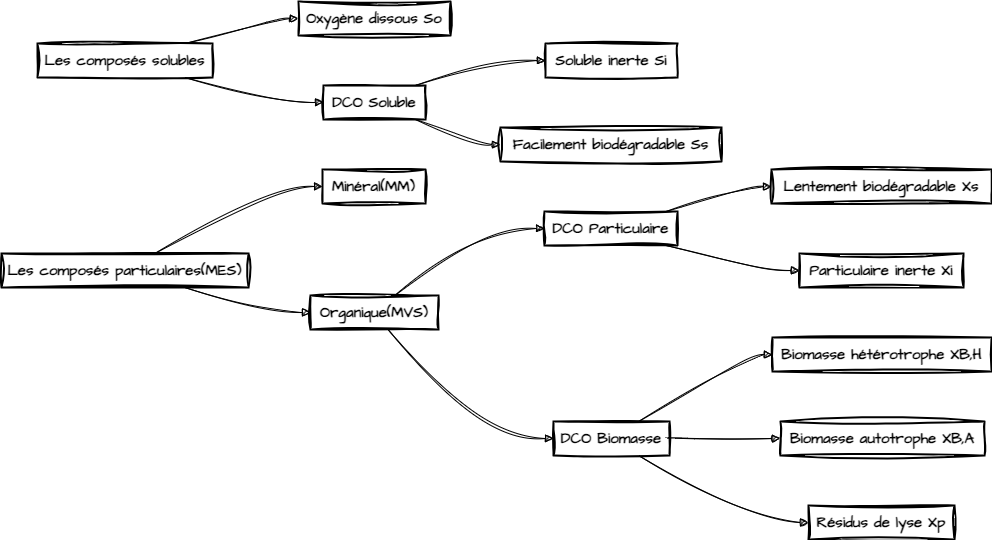
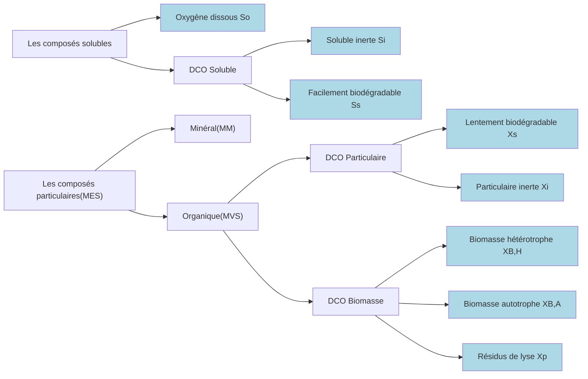

# ASM1

## Article : *Modélisation dynamique des procédés biologiques de traitement des eaux* (2007)

Modélisation dynamique des procédés biologiques de traitement des eaux - Mathieu SPÉRANDIO, Marc HERAN, Sylvie GILLOT - Technique de l'ingénieur, 10/08/2007

### Approches, grandeurs et unités

#### Paramètres globaux de caractérisation/quantification des eaux usées

| name | def                           | unité      |
|------|-------------------------------|------------|
| DCO  | Demande Chimique en Oxygène   | mg O₂/L    |
| DBO  | Demande Biologique en Oxygène | mg O₂/L    |
| MES  | Matière En Suspension         | mg/L       |
| MVS  | Matière Volatile en Suspension| mg/L       |
| NGL  | Azote global                  | mg N/L     |
| NTK  | Azote Kjeldahl                | mg N/L     |

#### Variables d'état du modèle ASM1

Le modèle ASM1 décompose la pollution organique ainsi

| name    | def                                                                                                                                                              | unit         |
|---------|------------------------------------------------------------------------------------------------------------------------------------------------------------------|--------------|
| S_I     | Substances inertes solubles : composés solubles dont la dégradation est trop lente pour être considérée comme biodégradable                                            | mg COD/L     |
| X_I     | Substances inertes particulaires : composés particulaires non biodégradables qui traversent le procédé sans modification                                             | mg COD/L     |
| S_S     | Substances facilement biodégradables : petites molécules solubles (acides gras volatils, alcools, sucres, acides aminés) utilisées directement comme énergie      | mg COD/L     |
| X_S     | Substances lentement biodégradables : composés complexes (fraction majoritaire des eaux résiduaires) nécessitant une hydrolyse extracellulaire, supposés insolubles  | mg COD/L     |
| X_B,H   | Biomasse hétérotrophe : micro-organismes utilisant les matières organiques pour l’énergie et la croissance                                                            | mg COD/L     |
| X_B,A   | Biomasse autotrophe : micro-organismes se nourrissant d’azote ammoniacal (pour le catabolisme) et de carbone minéral (pour l’anabolisme)                           | mg COD/L     |
| X_P     | Débris inertes issus de la lyse bactérienne                                                                                                                        | mg COD/L     |
| S_ND    | Azote organique soluble : principalement constitué par l’urée dans les eaux résiduaires                                                                             | gN·L⁻¹       |
| X_ND    | Azote organique particulaire : protéines et autres composés organiques liés à la matière particulaire                                                                | gN·L⁻¹       |
| S_NH    | Azote ammoniacal : forme libre et ionique de l’ammoniaque                                                                                                          | gN·L⁻¹       |
| S_NO    | Azote oxydé : somme des nitrites et des nitrates                                                                                                                   | gN·L⁻¹       |
| S_O     | Oxygène dissous : oxygène disponible dans l’eau                                                                                                                    | mg O₂/L      |
| S_alk   | Alcalinité : capacité de l’eau à neutraliser les acides                                                                                                            | meq/L        |

#### Fractionnement de la matière en variable d'état du modèle ASM1

### Modèle réactionnel - Cinétiques (aérobie)

#### Matrice du modèle ASM1

| j | $\nu_{ij}$ | i=1 Sᵢ | 2 Sₛ | 3 Xᵢ | 4 Xₛ | 5 Xᵦₕ | 6 Xᵦₐ | 7 Xₚ | 8 Sₒ | 9 Sₙₒ | 10 Sₙₕ | 11 Sₙₚ | 12 Xₙₚ | 13 Sₐₗₖ | Vitesse de réaction |
|---|---|---|---|---|---|---|---|---|---|---|---|---|---|---|---|
| 1 | croissance aérobie des hétérotrophes | | -1/Yₕ | | | 1 | | | 1-Yₕ/Yₕ | | -iₓᵦ | | | -iₓᵦ/14 | ρ₁ |
| 2 | croissance anoxique des hétérotrophes | | -1/Yₕ | | | 1 | | | | 1-Yₕ/2.86·Yₕ | -iₓᵦ | | | (1-Yₕ)/(2.86·Yₕ-iₓᵦ)·14 | ρ₂ |
| 3 | croissance aérobie des autotrophes | | | | | | 1 | | (4.57-Yₐ)/Yₐ | 1/Yₐ | -iₓᵦ-1/Yₐ | | | [-iₓᵦ-2/Yₐ]·14 | ρ₃ |
| 4 | décès des hétérotrophes | | | 1-fₚ | -1 | | | fₚ | | | | iₓᵦ-fₚ·iₓₚ | | | ρ₄ |
| 5 | décès des autotrophes | | | 1-fₚ | -1 | | | fₚ | | | | iₓᵦ-fₚ·iₓₚ | | | ρ₅ |
| 6 | ammonification de l'azote organique soluble | | | | | | | | | | 1 | -1 | | 1/14 | ρ₆ |
| 7 | hydrolyse du carbone organique particulaire | | 1 | | -1 | | | | | | | | | | ρ₇ |
| 8 | hydrolyse de l'azote organique particulaire | | | | | | | | | | 1 | -1 | | | ρ₈ |

#### Variables

| Name | Definition | Unité |
|------|------------|-------|
| $S_I$| Matière soluble inerte (non biodégradable) | en M (DCO) · L⁻³ |
| $S_S$| Substrat soluble rapidement biodégradable | en M (DCO) · L⁻³ |
| $X_I$| Matière particulaire inerte (non biodégradable) | en M (DCO) · L⁻³ |
| $X_S$| Substrat lentement biodégradable | en M (DCO) · L⁻³ |
| $X_{B,H}$| Biomasse active hétérotrophe | en M (DCO) · L⁻³ |
| $X_{B,A}$| Biomasse active autotrophe | en M (DCO) · L⁻³ |
| $X_P$| Matière particulaire non biodégradable issue de la lyse | en M (DCO) · L⁻³ |
| $S_O$| Oxygène dissous | en M (O₂) · L⁻³ |
| $S_{NO}$| Nitrate et nitrite (NO₃⁻ et NO₂⁻) | en M (N) · L⁻³ |
| $S_{NH}$| Ammonium et ammoniac (NH₄⁺ et NH₃) | en M (N) · L⁻³ |
| $S_{ND}$| Azote organique soluble et biodégradable | en M (N) · L⁻³ |
| $X_{ND}$| Azote organique particulaire et biodégradable | en M (N) · L⁻³ |
| $S_{ALK}$| Alcalinité | en M (mol) · L⁻³ |

#### Equations

$$
\rho_1 = \mu_{mH} \cdot \frac{S_S}{S_S + K_S} \cdot \frac{S_O}{S_O + K_{OH}} \cdot X_{B,H}
$$

$$
\rho_2 = \mu_{mH} \cdot \frac{S_S}{S_S + K_S} \cdot \frac{K_{OH}}{K_{OH} + S_O} \cdot \frac{S_{NO}}{S_{NO} + K_{NO}} \cdot \eta_g \cdot X_{B,H}
$$

$$
\rho_3 = \mu_{mA} \cdot \frac{S_{NH}}{S_{NH} + K_{NH}} \cdot \frac{S_O}{S_O + K_{OA}} \cdot X_{B,A}
$$

$$
\rho_4 = b_H \cdot X_{B,H}
$$

$$
\rho_5 = b_A \cdot X_{B,A}
$$

$$
\rho_6 = k_a \cdot S_{ND} \cdot X_{B,H}
$$

$$
\rho_7 = k_{H} \cdot \frac{\frac{X_S}{X_{B,H}} }{K_X + \frac{X_S}{X_{B,H}} } \cdot \left[ \frac{S_O}{S_O + K_{OH}} + \eta_h \cdot \frac{K_{OH}}{K_{OH} + S_O} \cdot \frac{S_{NO}}{S_{NO} + K_{NO}} \right] \cdot X_{B,H}
$$

$$
\rho_8 = \rho_7 \cdot \frac{X_{ND}}{X_S}
$$

#### Transformation de la matière organique

Dans le modèle ASM1, la transformation de la matière organique s’effectue en trois grandes étapes :

1. **Hydrolyse**  
   Conversion de la fraction lentement biodégradable (particulaire), $X_S$, en substrat soluble rapidement biodégradable, $S_S$.  
   L'équation de la cinétique d'hydrolyse s'exprime par :

   $$
   \rho_7 = k_{H} \cdot \underbrace{\frac{\dfrac{X_S}{X_{B,H}}}{K_X + \dfrac{X_S}{X_{B,H}}}}_{\text{Saturation hydrolytique}} \cdot     \underbrace{\left[\frac{S_O}{S_O + K_{OH}} + \eta_h \cdot \frac{K_{OH}}{K_{OH} + S_O} \cdot \frac{S_{NO}}{S_{NO} + K_{NO}}\right]}_{\substack{\text{Contribution aérobique} \\ \text{et anoxique}}} \cdot X_{B,H}
   $$

   - **$k_H$** est la constante de réaction d'hydrolyse.  
   - Le terme $\frac{\frac{X_S}{X_{B,H}}}{K_X + \frac{X_S}{X_{B,H}}}$modélise l'effet de saturation hydrolytique.  
   - Le terme entre crochets décrit l'influence des conditions oxydantes et réductrices :
     - contribution aérobique

      $$
      \frac{S_O}{S_O + K_{OH}}
      $$

     - Contribution anoxique (où la dégradation se fait en présence de nitrate) :

      $$
      \eta_h \cdot \frac{K_{OH}}{K_{OH} + S_O} \cdot \frac{S_{NO}}{S_{NO} + K_{NO}}
      $$

   - Le facteur final $X_{B,H}$tient compte de la biomasse hétérotrophe active qui catalyse l'hydrolyse.

2. **Croissance**  
   Utilisation du substrat soluble $S_S$par les hétérotrophes pour produire de la biomasse active $X_{B,H}$.  
   La croissance se modélise par l'équation suivante :

   $$
   \rho_1 = \mu_{mH} \cdot \frac{S_S}{S_S + K_S} \cdot \frac{S_O}{S_O + K_{OH}} \cdot X_{B,H}
   $$

3. **Lyse**  
   La mort de la biomasse active hétérotrophe conduit à la formation de débris inertes, notés $X_P$, issus de la lyse cellulaire.  
   La cinétique de lyse est donnée par :

$$
\rho_4 = b_H \cdot X_{B,H}
$$

#### Transformation de l'azote

Dans le modèle ASM1, la transformation de l'azote est relativement simple et s'inspire de la transformation de la matière organique. On distingue principalement deux voies :

1. **Hydrolyse de l’azote particulaire**  
   L’azote organique lié aux particules (noté $X_{ND}$) est hydrolysé en azote organique soluble (noté $S_{ND}$).  
   La vitesse de cette réaction est donnée par :  

   $$
   \rho_8 = \rho_7 \cdot \frac{X_{ND}}{X_S}
   $$
   
   où $\rho_7$représente la vitesse d’hydrolyse de la fraction carbonée particulaire ($X_S$).

2. **Ammonification et nitrification de l’azote organique soluble**  
   Une fois en solution, l’azote organique soluble ($S_{ND}$) est d’abord ammonifié pour former l’azote ammoniacal ($S_{NH}$). La vitesse d’ammonification est décrite par :  
   
   $$
   \rho_6 = k_a \cdot S_{ND} \cdot X_{B,H}
   $$
   
   Ensuite, l’ammonium issu de cette réaction est oxydé par des bactéries autotrophes en présence d’oxygène pour former du nitrate ($S_{NO}$). L’étape limitante étant la nitrification (*simplification : nitrosation + nitratation modélisé en une étape*), sa vitesse est modélisée par :  
   
   $$
   \rho_3 = \mu_{mA} \cdot \frac{S_{NH}}{S_{NH} + K_{NH}} \cdot \frac{S_O}{S_O + K_{OA}} \cdot X_{B,A}
   $$
   
   La réaction globale de nitrification est :
   
   $$
   NH_{4}^{+} + 2\, O_2 \rightarrow NO_3^{-} + H_2O + 2\, H^+
   $$
   
   *(En supposant que tout l'azote est oxydé sous forme de nitrate, la consommation stœchiométrique d'oxygène est de 4.57 g O₂ par g de N-NO₃).*

    D'autre part, une partie de l'azote ammoniacal ($S_{NH}$) est assimilée dans la biomasse, proportionnelle à la vitesse de croissance des bactéries autotrophes, tandis que le nitrate produit par la nitrification est ensuite dénitrifié par des bactéries hétérotrophes en conditions anoxiques. La dénitrification est modélisée par :
    
    $$
    \rho_2 = \mu_{mH} \cdot \frac{S_S}{S_S + K_S} \cdot \frac{K_{OH}}{K_{OH} + S_O} \cdot \frac{S_{NO}}{S_{NO} + K_{NO}} \cdot \eta_g \cdot X_{B,H}
    $$

### Paramètres

- **Paramètres** (nom de la grandeur)
- **Unités** (unité de mesure)
- **Valeur par défaut** (indiquée dans la référence)
- **CEMAGREF** (valeurs proposées par ces références)

> **Remarque :** Les colonnes « T = 20 °C », « T = 10 °C » et « T = 0 °C » peuvent être interprétées comme des variations de température, chacune associée à un jeu de paramètres différent. Selon la présentation originale, on peut soit fusionner ces colonnes, soit les séparer en plusieurs lignes. Ici, on propose une version compacte :

-- Exemples de jeux de paramètres pour le modèle ASM1

| Paramètres        | Unités               | Valeur par défaut [16] | T = 20 °C | T = 10 °C | T = 0 °C | CEMAGREF |
|-------------------|----------------------|------------------------|----------|----------|---------|-----------------------|
| Température (T)   | °C                   | 20                     | 20       | 10       | 0       | 10 / 5 / ...          |
| YA     | g DCO·g⁻¹ N         | 0,24                   | 0,24     | 0,24     | 0,24    | 0,24                  |
| YH     | g DCO·g⁻¹ DCO       | 0,67                   | 0,67     | 0,67     | 0,67    | 0,65                  |
| ig     | g N·g⁻¹ DCO         | 0,08                   | 0,08     | 0,08     | 0,08    | 0,07                  |
| iXB    | g N·g⁻¹ DCO         | 0,086                  | 0,086    | 0,086    | 0,086   | 0,07–0,08             |
| fp     | –                    | 0,08                   | 0,08     | 0,08     | 0,08    | 0,08                  |
| bH     | d⁻¹                 | 0,62                   | 0,62     | 0,62     | 0,62    | 0,3–0,4               |
| μH     | d⁻¹                 | 6,0                    | 6,0      | 3,0      | 1,0     | 4,0                    |
| KS     | g DCO·m⁻³           | 10                     | 10       | 10       | 10      | 10–20                 |
| KOH    | g O₂·m⁻³            | 0,2                    | 0,2      | 0,2      | 0,2     | 0,2–0,4               |
| KNO    | g N–NO3·m⁻³ | 0,5                  | 0,5      | 0,5      | 0,5     | 0,5–1,0               |
| ηg     | –                   | 0,8                    | 0,8      | 0,8      | 0,8     | 0,6–0,8              |
| ka     | g N·(g DCO·d)⁻¹    | 0,05                   | 0,05     | 0,02     | 0,01    | 0,04                  |
| kh     | g DCO·(g DCO·d)⁻¹  | 3,0                    | 3,0      | 1,5      | 0,5     | 2,0–3,0               |
| KX     | g DCO·(g DCO)⁻¹    | 0,1                    | 0,1      | 0,1      | 0,1     | 0,1–0,2               |
| μA     | d⁻¹                | 0,8                    | 0,8      | 0,4      | 0,1     | 0,5–0,7               |
| KNH    | g N–NH4·m⁻³ | 1,0                  | 1,0      | 1,0      | 1,0     | 0,5–1,5               |
| KOA    | g O₂·m⁻³           | 0,4                    | 0,4      | 0,4      | 0,4     | 0,4–0,6               |
| bA     | d⁻¹                | 0,05                   | 0,05     | 0,03     | 0,01    | 0,04–0,05             |

- CEMAGREF :
  - MARQUOT (A.). – Modélisation du traitement de l’azote par boues activées en sites réels : calage et évaluation du modèle ASM1. Thèse de Doctorat, Université de Pau et des Pays de l’Adour, École Doctorale des Sciences Exactes et de leurs Applications, Spécialité Génie des Procédés, 307 p. (2006).
  - CHOUBERT (J.M.), RACAULT (Y.), GRASMICK(A.), BECK (C.) et HEDUIT (A.). – Nitrogenremoval from urban wastewater by activatedsludge process operated over the conventional carbon loading rate limit at low tempera-ture, Water SA, 31 (4), pp. 503-510, 2005.
- Défaut :
  - HENZE (M.). – Characterization of wastewaters for modelling of activated sludge processes, Wat. Sci. Tech., 25, 6, pp. 1-15, 1992

### Nomenclature

| Symbole    | Signification                                     | Unité ou dimension         |
|------------|---------------------------------------------------|----------------------------|
| YA  | Rendement de conversion autotrophe               | (sans dimension)           |
| YH  | Rendement de conversion hétérotrophe             | (sans dimension)           |
| fp  | Fraction inerte de la biomasse                    | (sans dimension)           |
| iXB | Teneur en azote de la biomasse                     | g N · g⁻¹ DCO (ou similaire) |
| iXP | Teneur en azote des produits de lyse              | g N · g⁻¹ DCO (ou similaire) |
| μH  | Taux de croissance maximum hétérotrophe           | T⁻¹ (ex. d⁻¹)             |
| μA  | Taux de croissance maximum autotrophe             | T⁻¹ (ex. d⁻¹)             |
| ka  | Taux d’ammonification                             | T⁻¹                        |
| kh  | Taux d’hydrolyse                                  | T⁻¹                        |
| KS  | Constante de demi-saturation pour le substrat     | M · L⁻³ (ex. mg COD · L⁻¹) |
| KNH | Constante de demi-saturation pour le substrat ammonium | M · L⁻³ (ex. mg N · L⁻¹)   |
| KOH | Constante de demi-saturation pour l’oxygène (hétérotrophes) | M · L⁻³               |
| KOA | Constante de demi-saturation pour l’oxygène (autotrophes)   | M · L⁻³               |
| KNO | Constante de demi-saturation pour les nitrates/nitrites     | M · L⁻³               |
| bH  | Taux de décès hétérotrophe                        | T⁻¹                        |
| bA  | Taux de décès autotrophe                          | T⁻¹                        |

> **Remarques :**  
>
> - Les « M · L⁻³ » représentent une concentration massique (ex. mg COD · L⁻¹, mg N · L⁻¹, etc.).  
> - Les rendements (YA, YH) et fractions inertes (fp) sont sans dimension.  
> - Les teneurs en azote (iXB, iXP) s’expriment souvent en g N par g DCO.  
> - Les taux de croissance (μH, μA), d’ammonification (ka), d’hydrolyse (kh) et de décès (bH, bA) ont typiquement pour dimension T⁻¹ (par exemple, d⁻¹).

___
___
___

## WEST - Modèle ASM1Temp

### 1. Introduction

Le modèle **ASM1Temp** est une extension du classique Activated Sludge Model No. 1 (ASM1). Il intègre l’influence de la température sur les processus biologiques et physico-chimiques intervenant dans les stations d’épuration à boues activées. L’objectif est de simuler de manière réaliste la dynamique microbienne et les transformations chimiques (croissance, dénitrification, nitrification, décroissance, hydrolyse) en fonction des variations de température, un facteur déterminant dans la performance du traitement.

---

### 2. Définition du Système et Hypothèses

- **Système étudié :**
  - **Frontières :**  
    - **Interne :** réacteur biologique (boues activées) avec sa phase liquide et ses réactions chimiques.
    - **Externe :** influent (apport de matière organique et azotée), effluent (rejet traité), aération (transfert d’oxygène).
  
- **Hypothèses principales :**
  - Les réactions suivent des cinétiques de type Michaelis-Menten (ou Hill).
  - Le système est ouvert, avec des apports et rejets de matière.
  - L’effet de la température est modélisé par une loi exponentielle :
    $
    k(T) = k_{ref} \cdot \theta^{(T - T_{ref})}
    $
  - Les processus physiques (hydraulique, transfert de masse) sont considérés séparément ou intégrés via des termes spécifiques (ex. aération).

---

### 3. Variables d’État et Plages de Valeurs

Les variables d’état représentent les concentrations (en g COD/m³, gN/m³, meq/L, etc.) et se répartissent en deux grandes catégories :

#### 3.1 Variables Solubles

- **$S_I$** : Substrat soluble inerte  
- **$S_S$** : Substrat soluble facilement biodégradable  
- **$S_O$** : Oxygène dissous  
- **$S_{NO}$** : Nitrate + Nitrite  
- **$S_{ND}$** : Azote organique soluble (biodégradable)  
- **$S_{NH}$** : Ammonium/Ammoniac  
- **$S_{ALK}$** : Alcalinité (en meq/L)

#### 3.2 Variables Particulaires

- **$X_I$** : Matière particulaire inerte  
- **$X_{BH}$** : Biomasse hétérotrophe active  
- **$X_{BA}$** : Biomasse autotrophe (nitrifiante)  
- **$X_P$** : Produits particulaires inertes (débris)  
- **$X_S$** : Substrat particulaire lentement biodégradable  
- **$X_{ND}$** : Azote organique particulaire (biodégradable)

#### Exemple de plages typiques

| Variable | Plage Typique |
|----------|---------------|
| $S_O$ | 8–10 mg O$_2$/L à 20–25 °C |
| $S_S$ | 20–200 mg COD/L |
| $S_{NH}$| 10–40 mg N/L |
| $X_{BH}$| 100–500 mg COD/L |
| $\mu_H$(taux de croissance hétérotrophe) | 0,8–2,0 d$^{-1}$|
| $b_H$(décroissance hétérotrophe) | 0,05–0,15 d$^{-1}$|

*Ces valeurs sont indicatives et doivent être adaptées au contexte opérationnel.*

---

### 4. Équations Cinétiques du Modèle

Le modèle ASM1Temp regroupe l’ensemble des transformations biologiques et physico-chimiques sous forme d’équations cinétiques. On distingue notamment :

#### 4.1 Processus Biologiques

1. **Croissance Aérobie des Hétérotrophes**  
   *Transformation :* Consommation du substrat soluble biodégradable ($S_S$) en présence d’oxygène ($S_O$) pour produire de la biomasse hétérotrophe ($X_{BH}$).  
   *Équation :*
   $
   \rho_{AerGrowthHetero} = \mu_{H,Temp} \cdot \frac{S_S}{K_S+S_S} \cdot \frac{S_O}{K_{OH}+S_O} \cdot \frac{S_{NH}}{K_{NH\_H}+S_{NH}} \cdot X_{BH}
   $

2. **Croissance Anoxique (Dénitrification) des Hétérotrophes**  
   *Transformation :* Utilisation du substrat soluble en absence (ou faible concentration) d’oxygène, avec nitrate/nitrite ($S_{NO}$) servant d’accepteur d’électrons.  
   *Équation (exemple) :*
   $
   \rho_{AnGrowthHetero} = \mu_{H,Temp} \cdot \frac{S_S}{K_S+S_S} \cdot \frac{K_{OH}}{K_{OH}+S_O} \cdot \frac{S_{NO}}{K_{NO}+S_{NO}} \cdot \frac{S_{NH}}{K_{NH\_H}+S_{NH}} \cdot n_g \cdot X_{BH}
   $

3. **Croissance Aérobie des Autotrophes (Nitrification)**  
   *Transformation :* Oxydation de l’ammonium ($S_{NH}$) en nitrate/nitrite ($S_{NO}$) par la biomasse autotrophe ($X_{BA}$).  
   *Équation :*
   $
   \rho_{AerGrowthAuto} = \mu_{A,Temp} \cdot \frac{S_{NH}}{K_{NH}+S_{NH}} \cdot \frac{S_O}{K_{OA}+S_O} \cdot X_{BA}
   $

4. **Décroissance Endogène**  
   - **Hétérotrophes :**
     $
     \rho_{DecayOfHetero} = b_{H,Temp} \cdot X_{BH}
     $
   - **Autotrophes :**
     $
     \rho_{DecayOfAuto} = b_{A,Temp} \cdot X_{BA}
     $
   *Transformation :* Lyse naturelle conduisant à la formation de produits inertes et à la redistribution de l’azote organique.

5. **Hydrolyse du Substrat Particulaire Lentement Biodégradable**  
   *Transformation :* Conversion du substrat particulaire ($X_S$) en substrat soluble ($S_S$).  
   *Équation :*
   $
   \rho_{HydrolOfEntrOrg} = k_{h,Temp} \cdot \frac{\frac{X_S}{X_{BH}}}{K_X + \frac{X_S}{X_{BH}}} \cdot \left( \frac{S_O}{K_{OH}+S_O} + n_h \cdot \frac{K_{OH}}{K_{OH}+S_O} \cdot \frac{S_{NO}}{K_{NO}+S_{NO}} \right) \cdot X_{BH}
   $

6. **Hydrolyse de l’Azote Organique Particulaire**  
   *Transformation :* Conversion de l’azote organique associé aux particules ($X_{ND}$) en forme soluble ($S_{ND}$).  
   *Équation :*
   $
   \rho_{HydrolOfEntrOrgN} = \rho_{HydrolOfEntrOrg} \cdot \frac{X_{ND}}{X_S}
   $

#### 4.2 Transfert d’Oxygène

- **Saturation en Oxygène**  
  *Transformation :* Détermination de la concentration saturante d’oxygène en fonction de la température.  
  *Équation (exemple) :*
  $
  S_{O,sat} = 14.65 - 0.41\,T + 0.00799\,T^2 - 7.78\times10^{-5}\,T^3
  $

- **Cinétique d’Aération**  
  *Transformation :* Transfert d’oxygène de la phase gazeuse vers la phase liquide.  
  *Équation :*
  $
  \rho_{Aeration} = k_{la,Actual} \cdot (S_{O,sat} - S_O)
  $

---

### 5. Intégration de l’Effet de la Température

Tous les taux cinétiques sont ajustés en fonction de la température réelle du système par une loi exponentielle :

- **Formule Générale :**
  $
  k(T) = k_{ref} \cdot \theta^{(T-T_{ref})}
  $
  
- **Exemples :**
  - Croissance autotrophe :
    $
    \mu_{A,Temp} = \mu_A \cdot \theta_{\mu_A}^{(T-T_{ref})}
    $
  - Décroissance des biomasses :
    $
    b_{H,Temp} = b_H \cdot \theta_{b_H}^{(T-T_{ref})}, \quad b_{A,Temp} = b_A \cdot \theta_{b_A}^{(T-T_{ref})}
    $
  
Les coefficients $\theta$(par exemple $\theta_{\mu_A}$, $\theta_{b_H}$, etc.) permettent de corriger les taux de réaction selon l’écart entre la température actuelle et la température de référence (souvent 20 °C).

---

### 6. Matrice Stœchiométrique

La matrice stœchiométrique relie chaque processus cinétique aux variables d’état. Un exemple synthétique est présenté ci-dessous pour quelques réactions clés :

#### Exemple pour **AerGrowthAuto**

| **Processus**             | **S_ALK**                                                            | **S_NH**                 | **S_NO**                         | **S_O**                           | **X_BA** | **X_BH** | **S_S**          | **X_ND**                        | **X_P**   | **X_S**         | **S_ND** |
|---------------------------|----------------------------------------------------------------------|--------------------------|----------------------------------|-----------------------------------|----------|----------|------------------|---------------------------------|-----------|-----------------|----------|
| **AerGrowthAuto**         | $-\dfrac{i_{X_B}}{14} - \dfrac{1}{7\,Y_A}$                          | $-i_{X_B} - \dfrac{1}{Y_A}$| $+\dfrac{1}{Y_A}$              | $-\dfrac{4.57 - Y_A}{Y_A}$        | **+1**   | 0        | 0                | 0                               | 0         | 0               | 0        |
| **AerGrowthHetero**       | $-\dfrac{i_{X_B}}{14}$                                             | $-i_{X_B}$            | 0                                | $-\dfrac{1 - Y_H}{Y_H}$           | 0        | **+1**   | $-\dfrac{1}{Y_H}$| 0                               | 0         | 0               | 0        |
| **Aeration**              | 0                                                                    | 0                        | 0                                | **+1**                          | 0        | 0        | 0                | 0                               | 0         | 0               | 0        |
| **AmmonOfSolOrgN**        | **+1⁄14**                                                            | **+1**                   | 0                                | 0                                 | 0        | 0        | 0                | **–1**                         | 0         | 0               | 0        |
| **AnGrowthHetero**        | $\displaystyle \frac{1-Y_H}{14\cdot2.86\cdot Y_H} - \frac{i_{X_B}}{14}$| $-i_{X_B}$            | $-\dfrac{1-Y_H}{2.86\,Y_H}$     | 0                                 | 0        | **+1**   | $-\dfrac{1}{Y_H}$| 0                               | 0         | 0               | 0        |
| **DecayOfAuto**           | 0                                                                    | 0                        | 0                                | 0                                 | **–1**   | 0        | 0                | $i_{X_B} - f_P\,i_{X_P}$        | **f_P**  | $1 - f_P$    | 0        |
| **DecayOfHetero**         | 0                                                                    | 0                        | 0                                | 0                                 | 0        | **–1**   | 0                | $i_{X_B} - f_P\,i_{X_P}$        | **f_P**  | $1 - f_P$    | 0        |
| **HydrolOfEntrOrg**       | 0                                                                    | 0                        | 0                                | 0                                 | 0        | 0        | **+1**         | 0                               | 0         | **–1**         | 0        |
| **HydrolOfEntrOrgN**      | 0                                                                    | 0                        | 0                                | 0                                 | 0        | 0        | 0                | **–1**                         | 0         | 0               | **+1**   |

---

### Description détaillée des transformations

1. **AerGrowthAuto (Croissance aérobie autotrophe)**  
   - **S_ALK :** Consomme l’alcalinité pour la conversion de l’ammonium en nitrites/nitrates, incluant une perte liée à la formation de biomasse (le terme $1/(7\,Y_A)$).  
   - **S_NH :** Consommation d’ammonium pour la croissance, avec un terme supplémentaire lié à la biomasse ($1/Y_A$).  
   - **S_NO :** Production de nitrate/nitrite à hauteur de $1/Y_A$.  
   - **S_O :** Consommation d’oxygène modélisée par $- (4.57 - Y_A)/Y_A$.  
   - **X_BA :** Formation d’une unité de biomasse autotrophe.

2. **AerGrowthHetero (Croissance aérobie hétérotrophe)**  
   - **S_ALK :** Consommation d’alcalinité proportionnelle à $i_{X_B}/14$.  
   - **S_NH :** Consommation d’ammonium proportionnelle à $i_{X_B}$.  
   - **S_O :** Consommation d’oxygène représentée par $- (1 - Y_H)/Y_H$.  
   - **S_S :** Conversion du substrat soluble, avec une consommation de $1/Y_H$.  
   - **X_BH :** Production d’une unité de biomasse hétérotrophe.

3. **Aeration**  
   - **S_O :** Injection directe d’oxygène (coefficient +1).

4. **AmmonOfSolOrgN (Conversion de l’azote organique soluble en ammonium)**  
   - **S_ALK :** Production d’alcalinité (1/14).  
   - **S_NH :** Production d’ammonium (+1).  
   - **S_ND :** Consommation d’azote organique soluble (–1).

5. **AnGrowthHetero (Croissance anoxique hétérotrophe – dénitrification)**  
   - **S_ALK :** Consommation d’alcalinité, selon la formule indiquée, intégrant le terme inhibiteur $i_{X_B}$.  
   - **S_NH :** Consommation d’ammonium proportionnelle à $i_{X_B}$.  
   - **S_NO :** Consommation de nitrate/nitrite (– (1 – Y_H)/(2.86·Y_H)).  
   - **S_S :** Consommation du substrat soluble à hauteur de $1/Y_H$.  
   - **X_BH :** Production d’une unité de biomasse hétérotrophe.

6. **DecayOfAuto (Décroissance endogène des autotrophes)**  
   - **X_BA :** Perte complète de la biomasse autotrophe (–1).  
   - **X_ND :** Formation d’azote organique particulaire selon $i_{X_B} - f_P \cdot i_{X_P}$.  
   - **X_P :** Formation de produits inertes (la fraction $f_P$).  
   - **X_S :** Reste de matière organique particulaire (1 – $f_P$).

7. **DecayOfHetero (Décroissance endogène des hétérotrophes)**  
   - **X_BH :** Perte complète de la biomasse hétérotrophe (–1).  
   - **X_ND :** Formation d’azote organique particulaire ($i_{X_B} - f_P \cdot i_{X_P}$).  
   - **X_P :** Formation de produits inertes ($f_P$).  
   - **X_S :** Reste de matière particulaire (1 – $f_P$).

8. **HydrolOfEntrOrg (Hydrolyse de la matière organique entrante)**  
   - **S_S :** Production de substrat soluble (+1) à partir du substrat insoluble.  
   - **X_S :** Consommation de la matière organique particulaire (–1).

9. **HydrolOfEntrOrgN (Hydrolyse de l’azote organique entrante)**  
   - **S_ND :** Production d’azote organique soluble (+1).  
   - **X_ND :** Consommation d’azote organique particulaire (–1).

*Les coefficients négatifs traduisent une consommation tandis que les coefficients positifs indiquent une production.*

---

### 7. Capteurs et Conversion en Mesures Opérationnelles

Pour relier les résultats de la simulation aux mesures opérationnelles, une interface de capteurs est définie. Par exemple :

Voici le tableau mis à jour et complété à partir des données extraites du modèle ASM1Temp. Les variables d'état correspondantes proviennent du modèle ASM1Temp, utilisé pour la modélisation des procédés de boues activées avec prise en compte de la température :

| Variable du modèle (Interface) | Description du capteur                         | Variable d’état correspondante (ASM1Temp)                  |
|--------------------------------|------------------------------------------------|-------------------------------------------------------------|
| **DO**                         | Concentration en oxygène dissous               | $C[S_O]$                                               |
| **NH4**                        | Concentration en ammonium                      | $C[S_{NH}]$                                            |
| **NO3**                        | Concentration en nitrate + nitrite             | $C[S_{NO}]$                                            |
| **OUR_ASU**                    | Taux d’absorption d’oxygène                    | $\text{AerGrowthAuto} + \text{AerGrowthHetero} + \text{Aeration}$|
| **TSS**                        | Solides totaux en suspension                   | $X_{TSS} = (X_{BH} + X_{BA} + X_{I} + X_{S} + X_{P}) \cdot F_{TSS/COD}$|
| **AUR**                        | Taux de consommation d'ammonium                | $\text{AerGrowthAuto} \cdot \frac{1}{Y_A} + \text{AerGrowthHetero} \cdot \frac{i_{XB}}{Y_H}$|
| **Kla_ASU**                    | Coefficient de transfert d'oxygène             | $K_{la}$(coefficient réel utilisé dans la cinétique)   |
| **NPR**                        | Taux de production de nitrate                  | $\text{AerGrowthAuto} \cdot \frac{1}{Y_A}$(lié à la nitrification) |
| **NUR**                        | Taux de consommation de nitrate                | $\text{AnGrowthHetero} \cdot \frac{1 - Y_H}{2.86 \cdot Y_H}$(lié à la dénitrification) |
| **OfflineBOD**                 | Demande biologique en oxygène (DBO)            | $S_S + X_S$(DBO soluble et particulaire)               |
| **OfflineTKN**                 | Azote Kjeldahl total                           | $S_{NH} + S_{ND} + X_{ND} + i_{XB}(X_{BH} + X_{BA})$   |
| **OnlineCOD**                  | Demande chimique en oxygène (DCO)              | $S_I + S_S + X_I + X_S + X_BH + X_BA + X_P$            |
| **OnlineTN**                   | Azote total                                    | $S_{NH} + S_{ND} + S_{NO} + X_{ND} + i_{XB}(X_{BH} + X_{BA})$|
| **V_ASU**                      | Volume du bassin d’aération                    | $V_{reactor}$                                          |

**Remarques et sources** :

- **X_TSS** est une combinaison de composants particulaires dans le modèle ASM1Temp.
- Le modèle ASM1Temp intègre des cinétiques de croissance autotrophe (AerGrowthAuto) et hétérotrophe (AerGrowthHetero), et d'autres processus liés à la consommation ou production d'azote et d'oxygène.

Ce tableau fournit ainsi une correspondance claire entre les variables de mesure issues du modèle ASM1Temp et les variables d'état correspondantes, en tenant compte de la nomenclature et des processus définis dans ce modèle précis.
Ces correspondances sont définies dans le fichier d’interface (ex. *wwtp.VolumeASM1TempModel.sensors.msl*) et permettent de convertir les résultats de simulation en indicateurs opérationnels (DCO, DBO, TKN, TN, etc.).

---

### 8. Paramètres du Modèle

Les paramètres du modèle réactionnel sont regroupés en différentes catégories : facteurs de conversion, constantes cinétiques, rendements de croissance et paramètres de composition. Voici un extrait du tableau des paramètres :

Voici le tableau complet et mis à jour, organisé par groupe de paramètres, en conformité avec le modèle ASM1Temp que tu utilises. Ce tableau inclut tous les paramètres clés du modèle :

#### Tableau des paramètres du modèle ASM1Temp (complet, ordonné par groupe)

| Nom                 | Description                                                       | Unité             | Valeur par défaut | Groupe           |
|---------------------|-------------------------------------------------------------------|-------------------|-------------------|------------------|
| **Paramètres cinétiques** | **—**                                                             | **—**             | **—**             | **Cinétique**    |
| $\mu_H$         | Taux maximal de croissance des hétérotrophes                      | 1/d               | 6.0               | Cinétique        |
| $\mu_A$         | Taux maximal de croissance des autotrophes                        | 1/d               | 0.8               | Cinétique        |
| $b_H$           | Taux de décroissance des hétérotrophes                            | 1/d               | 0.62              | Cinétique        |
| $b_A$           | Taux de décroissance des autotrophes                              | 1/d               | 0.15              | Cinétique        |
| $K_S$           | Demi-saturation substrat pour hétérotrophes                       | gCOD/m³           | 20                | Cinétique        |
| $K_{OH}$        | Demi-saturation oxygène (hétérotrophes)                           | gO₂/m³            | 0.2               | Cinétique        |
| $K_{OA}$        | Demi-saturation oxygène (autotrophes)                             | gO₂/m³            | 0.4               | Cinétique        |
| $K_{NO}$        | Demi-saturation nitrate (hétérotrophes dénitrifiants)             | gNO₃-N/m³         | 0.5               | Cinétique        |
| $K_{NH}$        | Demi-saturation ammonium (autotrophes)                            | gNH₃-N/m³         | 1.0               | Cinétique        |
| $K_{NH_H}$      | Demi-saturation ammonium (hétérotrophes)                          | gNH₃-N/m³         | 0.05              | Cinétique        |
| $k_h$           | Taux maximal d’hydrolyse                                          | gCOD/(gCOD·d)     | 3.0               | Cinétique        |
| $k_a$           | Taux maximal d’ammonification                                     | m³/(gCOD·d)       | 0.08              | Cinétique        |
| $K_{X}$         | Constante demi-saturation hydrolyse                               | gCOD/gCOD         | 0.1               | Cinétique        |
| **Paramètres stœchiométriques** | **—**                                                         | **—**             | **—**             | **Stœchiométrie**|
| $Y_H$           | Rendement de croissance hétérotrophe                              | gCOD/gCOD         | 0.67              | Stœchiométrie    |
| $Y_A$           | Rendement de croissance autotrophe                                | gCOD/gN           | 0.24              | Stœchiométrie    |
| $f_P$           | Fraction de biomasse convertie en matière inerte                  | -                 | 0.08              | Stœchiométrie    |
| $F_{BOD/COD}$   | Facteur de conversion DBO/DCO                                     | -                 | 0.65              | Stœchiométrie    |
| **Paramètres de composition** | **—**                                                          | **—**             | **—**             | **Composition**  |
| $i_{XB}$        | Masse d’azote par masse de DCO dans la biomasse                   | gN/gCOD           | 0.086             | Composition      |
| $i_{XP}$        | Masse d’azote par masse de DCO dans les produits formés           | gN/gCOD           | 0.06              | Composition      |
| **Paramètres de correction de température** | **—**                                            | **—**             | **—**             | **Température**  |
| $\theta_{\mu_H}$ | Facteur température pour $\mu_H$                             | -                 | 1.072             | Température      |
| $\theta_{\mu_A}$ | Facteur température pour $\mu_A$                             | -                 | 1.103             | Température      |
| $\theta_{b_H}$  | Facteur température pour $b_H$                                | -                 | 1.029             | Température      |
| $\theta_{b_A}$  | Facteur température pour $b_A$                                | -                 | 1.029             | Température      |
| $\theta_{k_h}$  | Facteur température pour $k_h$                                | -                 | 1.103             | Température      |
| $\theta_{k_a}$  | Facteur température pour $k_a$                                | -                 | 1.053             | Température      |

---

**Remarques importantes** :

- Les valeurs indiquées ici sont les valeurs typiques recommandées par la littérature standard sur les modèles ASM1/ASM1Temp et peuvent varier légèrement en fonction des conditions opérationnelles et des spécificités locales du traitement.
- Les paramètres de correction de température sont très importants dans la modélisation dynamique à température variable et sont spécifiques à l'ASM1Temp.
- Les unités sont celles généralement adoptées dans les modèles ASM et permettent d'assurer la cohérence et l'homogénéité des équations.
- Le paramètre $F_{BOD/COD}$ est un paramètre clé pour l’interprétation des résultats en DBO et DCO.
- Les valeurs par défaut présentées ici sont issues de la littérature courante sur le modèle ASM1Temp.

### 9. Synthèse des Transformations et Bilans

#### Processus Clés

- **AerGrowthAuto :**  
  - *Transformation :* Conversion de $S_{NH}$en $S_{NO}$avec consommation d’alcalinité ($S_{ALK}$) et formation de biomasse autotrophe ($X_{BA}$).  
  - *Bilan stœchiométrique :* Voir tableau associé en section 6.

- **AerGrowthHetero :**  
  - *Transformation :* Conversion du substrat soluble ($S_S$) en biomasse hétérotrophe ($X_{BH}$) avec consommation d’oxygène ($S_O$) et d’ammonium ($S_{NH}$).

- **AnGrowthHetero :**  
  - *Transformation :* Dénitrification en absence d’oxygène, consommant $S_{NO}$et $S_S$.

- **Décroissance :**  
  - *Transformation :* Lyse des biomasses (auto et hetero) conduisant à la formation de produits inertes ($X_P$) et à la redistribution de l’azote ($X_{ND}$).

- **Hydrolyse :**  
  - *Transformation :* Conversion du substrat particulaire ($X_S$) en substrat soluble ($S_S$) et transformation de l’azote organique particulaire ($X_{ND}$) en soluble ($S_{ND}$).

#### Bilans et Interactions Externes

- **Aération :** Injection d’oxygène modélisée via la différence entre $S_{O,sat}$et $S_O$.
- **Influent/Effluent :** Apports et rejets de matière influençant les bilans massiques du système.

---

### 10. Conclusion

Le modèle **ASM1Temp** permet de simuler de manière intégrée les processus réactionnels dans une station d’épuration à boues activées en tenant compte de l’effet de la température.  
Les principaux apports sont :

- Une modélisation plus réaliste des cinétiques biologiques (croissance, dénitrification, nitrification, décroissance, hydrolyse) grâce à l’ajustement exponentiel des taux.
- La prise en compte des interactions entre la phase liquide, les transferts d’oxygène et les bilans massiques.
- Une interface de capteurs permettant de traduire les résultats de simulation en indicateurs opérationnels.
